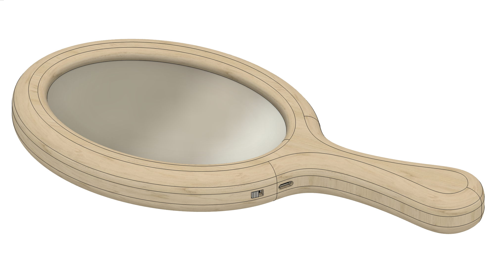
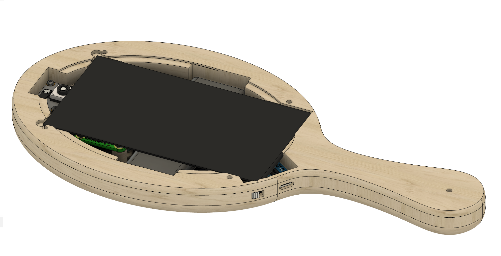
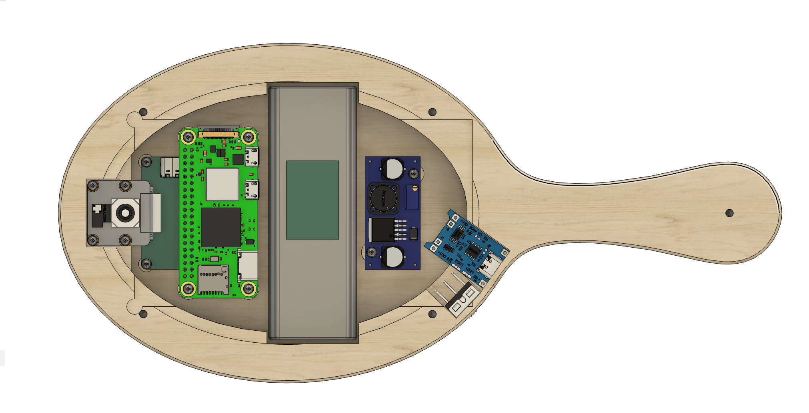

# Mirrormorphose-mini

After a first convincing implementation of Mirrormorphose, we wanted to explore a more intimate design: a hand mirror with new features.

## Features

- Picamera compatible
- Raspberry pi compatible (now Raspberry pi zero 2w)
- Server side on the mirror
- Client side on auxiliary device
- Face morphing module
- Background removal
- Runway API module
- Face Detection module
- Modest custom trained model
- Temporary file storage in RAM disk (Linux/macOS)

## System architecture 

We developped a new architecture to do heavy tasks like background removal and face morphing while still keeping the mirror the most independent as possible. 
The portable mirror is in charge of:
- displaying and looping the AI-generated video when a gaze is detected. 
- It will also serve a simple static website to let the user upload easily his child picture.
- It then sends a picture of the user and a picture of the first frame of the AI generated video to the auxiliary device. 

The auxiliary device then:
- Removes the background of both pictures
- Generates morphing video with those pictures
- Sends it to the server

When done, the mirror will start transforming the user into himself as a child when he stares at the mirror and when he looks away it fades away.

## Design

